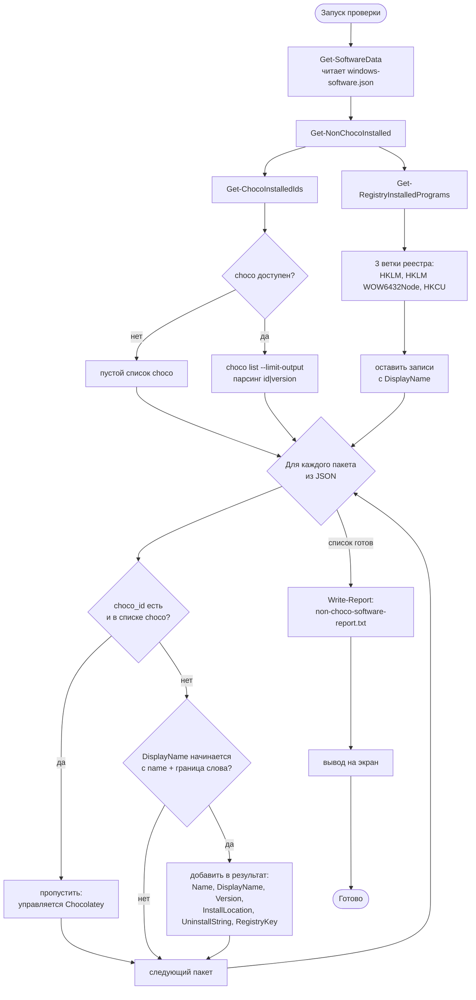

# Как работает обнаружение установленных программ

Этот документ детально описывает механизм, с помощью которого скрипты
`uninstall-software.ps1` и `install-software.ps1` находят программы из
списка `windows-software.json`, установленные на компьютере, и определяют,
какие из них установлены **вне пакетного менеджера Chocolatey**.

---

## 1. Общая идея

Скрипт отвечает на вопрос: *"Какие программы из моего списка уже стоят
на компьютере, но были установлены не через Chocolatey (вручную, через
официальный установщик, winget и т.п.)?"*

Чтобы ответить, скрипт сопоставляет три источника данных:

| Источник | Что дает | Функция |
|----------|----------|---------|
| `windows-software.json` | Список программ, которые нас интересуют (имя + `choco_id`) | `Get-SoftwareData` |
| Реестр Windows ("Удаление программ") | Что реально установлено на ПК | `Get-RegistryInstalledPrograms` |
| `choco list` | Что из установленного управляется Chocolatey | `Get-ChocoInstalledIds` |

Программа попадает в результат "установлена вне Chocolatey", если она
**есть в реестре**, но ее `choco_id` **отсутствует** в списке Chocolatey.

---

## 2. Источники данных подробно

### 2.1. Список интересующих программ (`windows-software.json`)

Функция `Get-SoftwareData` читает JSON и сохраняет его в переменную
`$script:SoftwareData`. Структура файла:

```json
{
  "software": {
    "development": {
      "category": "Разработка",
      "packages": [
        { "name": "Git", "choco_id": "git", "official_url": "..." },
        { "name": "Cursor", "choco_id": null,  "official_url": "..." }
      ]
    }
  }
}
```

Для обнаружения используются два поля каждого пакета:

- `name` — человекочитаемое имя, по которому ищется совпадение в реестре;
- `choco_id` — идентификатор пакета в Chocolatey (может быть `null`).

### 2.2. Реестр Windows — "Удаление программ"

Функция `Get-RegistryInstalledPrograms` читает три ветки реестра, в которых
Windows хранит сведения обо всех установленных программах (это тот же
источник, что показывает оснастка "Установка и удаление программ"):

```text
HKLM:\SOFTWARE\Microsoft\Windows\CurrentVersion\Uninstall\*
HKLM:\SOFTWARE\WOW6432Node\Microsoft\Windows\CurrentVersion\Uninstall\*
HKCU:\Software\Microsoft\Windows\CurrentVersion\Uninstall\*
```

Зачем именно три ветки:

| Ветка | Что в ней лежит |
|-------|-----------------|
| `HKLM\...\Uninstall` | 64-битные программы, установленные для всех пользователей |
| `HKLM\WOW6432Node\...\Uninstall` | 32-битные программы на 64-битной Windows |
| `HKCU\...\Uninstall` | Программы, установленные только для текущего пользователя (например, Cursor, Obsidian) |

Каждый подключ реестра — это одна установленная программа. Из его свойств
скрипт позже берет:

- `DisplayName` — отображаемое имя (например, `Google Chrome`);
- `DisplayVersion` — версия (например, `149.0.7827.54`);
- `InstallLocation` — путь установки (адрес хранения программы);
- `UninstallString` — команда штатного деинсталлятора;
- `PSPath` — полный путь к ключу реестра (для последующей проверки удаления).

Записи без `DisplayName` отбрасываются — это служебные ключи (обновления,
компоненты), которые не являются "программами" в привычном смысле.

`-ErrorAction SilentlyContinue` нужен, потому что ветка `HKCU` или отдельные
ключи могут отсутствовать или быть недоступны — скрипт не должен падать.

### 2.3. Список пакетов Chocolatey

Функция `Get-ChocoInstalledIds` возвращает массив идентификаторов пакетов,
установленных через Chocolatey.

1. Сначала `Test-Chocolatey` проверяет, доступна ли вообще команда `choco`
   (через `choco --version`). Если Chocolatey не установлен — возвращается
   пустой массив, и тогда **все** найденные в реестре программы будут
   считаться установленными вне Chocolatey.
2. Затем выполняется `choco list`. Здесь учтена разница версий:
   - **Chocolatey 1.x** требует флаг `--local-only`, чтобы показать
     локально установленные пакеты;
   - **Chocolatey 2.x** показывает локальные пакеты по умолчанию, а флаг
     `--local-only` удален.

   Поэтому сначала пробуется вариант с `--local-only`, и если он завершился
   с ошибкой или дал пустой вывод, выполняется команда без флага.
3. Флаг `--limit-output` заставляет choco выводить машиночитаемый формат
   `id|version` (по одной строке на пакет, без рамок и заголовков).
4. Регулярное выражение `^([^|]+)\|` забирает все символы до первого `|` —
   это и есть идентификатор пакета. Он приводится к нижнему регистру
   (`.ToLower()`), чтобы сравнение было нечувствительным к регистру.

---

## 3. Ядро обнаружения: `Get-NonChocoInstalled`

Это центральная функция. Она объединяет все три источника и формирует
итоговый список.

```text
chocoIds         = Get-ChocoInstalledIds          # что стоит из choco
registryPrograms = Get-RegistryInstalledPrograms  # что стоит вообще

для каждой категории в SoftwareData:
    для каждого package в категории:

        # Шаг 1: отсев пакетов, управляемых Chocolatey
        если package.choco_id задан И входит в chocoIds:
            пропустить (continue)

        # Шаг 2: поиск совпадения в реестре по имени
        если DisplayName начинается с package.name (с границей слова):
            добавить в результат объект с полями
            Name, DisplayName, DisplayVersion,
            InstallLocation, UninstallString, RegistryKey
```

### 3.1. Шаг 1 — отсев того, что стоит через Chocolatey

```powershell
if ($package.choco_id -and ($chocoIds -contains $package.choco_id.ToLower())) {
    continue
}
```

Если у пакета есть `choco_id` и он присутствует в списке Chocolatey, значит
эта программа уже под управлением Chocolatey — она нас не интересует и
пропускается. Остаются только кандидаты, которые либо без `choco_id`, либо
не найдены в выводе choco.

### 3.2. Шаг 2 — сопоставление имени с реестром

```powershell
$pattern = '^' + [regex]::Escape($package.name) + '\b'
```

Логика сопоставления:

- `^` — `DisplayName` должен **начинаться** с имени пакета;
- `[regex]::Escape(...)` — экранирует спецсимволы в имени (точки, плюсы
  и т.п.), чтобы они трактовались как обычный текст, а не как regex;
- `\b` — граница слова в конце. Это ключевая деталь: она не даст имени
  `Git` совпасть с `GitHub Desktop`, но при этом `Git` совпадет с
  `Git version 2.54` или просто `Git`.

Сравнение через `-match` в PowerShell по умолчанию **нечувствительно к
регистру**, поэтому `git`, `Git` и `GIT` дадут совпадение.

### 3.3. Что попадает в результат

Для каждого совпадения создается объект `[PSCustomObject]` с полями:

| Поле | Источник | Назначение |
|------|----------|------------|
| `Name` | `package.name` из JSON | Имя из нашего списка |
| `DisplayName` | реестр | Реальное имя как в "Удалении программ" |
| `DisplayVersion` | реестр | Версия установленной программы |
| `InstallLocation` | реестр | Путь, куда установлена программа |
| `UninstallString` | реестр | Команда для запуска деинсталлятора |
| `RegistryKey` | `PSPath` ключа | Используется для проверки факта удаления |

---

## 4. Важное отличие двух скриптов

Функция `Get-NonChocoInstalled` существует в обоих скриптах, но реализована
немного по-разному:

- **`install-software.ps1`** использует вспомогательную функцию
  `Find-RegistryProgram`, которая возвращает **первое** совпадение в
  реестре (`return` внутри цикла). То есть на каждый пакет добавляется
  максимум одна запись.

- **`uninstall-software.ps1`** не использует `Find-RegistryProgram`, а
  перебирает реестр инлайн и добавляет **все** совпадения. Если в системе
  две записи, начинающиеся одинаково, в отчет попадут обе.

На практике для текущего списка программ разница незаметна, но при удалении
важно видеть все записи, поэтому в uninstall-скрипте выбран более полный
вариант.

---

## 5. Полная схема потока данных



---

## 6. Результат: отчет `non-choco-software-report.txt`

Функция `Write-Report` (в `uninstall-software.ps1`) / `Write-NonChocoReport`
(в `install-software.ps1`) сохраняет найденные программы в текстовый файл
рядом со скриптом, в кодировке UTF-8. Пример содержимого:

```text
========================================
 NON-CHOCOLATEY SOFTWARE REPORT
 Generated : 2026-06-12 20:21:48
 Computer  : WIN11-MBELOUSOV
========================================

[1] Git
    Display name : Git
    Version      : 2.54.0
    Install path : C:\Program Files\Git\
    Uninstall    : "C:\Program Files\Git\unins000.exe"
    Registry key : HKEY_LOCAL_MACHINE\SOFTWARE\Microsoft\Windows\CurrentVersion\Uninstall\Git_is1

[3] Node.js
    Display name : Node.js
    Version      : 24.16.0
    Install path :
    Uninstall    : MsiExec.exe /I{8E3EF5A2-585E-453B-B16C-B46E05A62DAC}
    Registry key : HKEY_LOCAL_MACHINE\SOFTWARE\Microsoft\Windows\CurrentVersion\Uninstall\{8E3EF5A2-585E-453B-B16C-B46E05A62DAC}

Total: 2 program(s) installed outside Chocolatey.
```

При записи `RegistryKey` префикс
`Microsoft.PowerShell.Core\Registry::` удаляется регулярным выражением,
чтобы путь выглядел как привычный путь реестра (`HKEY_LOCAL_MACHINE\...`).

Поле `Install path` может быть пустым — не все программы записывают
`InstallLocation` в реестр (например, MSI-пакеты часто его не указывают).
Это нормально: для удаления используется `UninstallString`, а не путь.

---

## 7. Граничные случаи и поведение

| Ситуация | Поведение скрипта |
|----------|-------------------|
| Chocolatey не установлен | `Get-ChocoInstalledIds` вернет пустой список; все найденные в реестре программы будут считаться "вне Chocolatey" |
| У пакета `choco_id = null` (например, Cursor) | Шаг отсева пропускается, программа ищется в реестре напрямую |
| Программа есть в JSON, но не установлена | В реестре совпадения нет — в результат не попадает |
| `DisplayName` без `InstallLocation` | Запись все равно попадает в отчет, поле "Install path" пустое |
| Совпадение по началу имени (`Git` vs `GitHub`) | Граница слова `\b` предотвращает ложное совпадение |
| Нет прав на ветку реестра | `-ErrorAction SilentlyContinue` пропускает недоступные ключи без падения |

---

## 8. Где это вызывается

- **`install-software.ps1`** при запуске один раз вызывает
  `Update-InstallStatus`, которая теми же тремя источниками делит все пакеты
  из `windows-software.json` на группы: установлено через Chocolatey,
  установлено вне Chocolatey, не установлено. Счетчики групп показываются
  в главном меню.
  - Пункт меню **1** (`Install-NotInstalled`) ставит через Chocolatey только
    группу «не установлено». Программы, найденные в реестре (вне Chocolatey),
    в эту группу не входят, поэтому повторно через Chocolatey не ставятся.
    Дополнительно `Install-Software` перед установкой еще раз проверяет
    реестр как двойную защиту от дублирования.
  - Пункт меню **2** (`Show-StatusDetails`) печатает три списка по группам.
  - Пункт меню **4** (`Show-NonChocoSoftware`) выполняет проверку, печатает
    результат и пишет отчет `non-choco-software-report.txt`.
- **`uninstall-software.ps1`**, пункт меню **1** (`Invoke-ScanAndReport`):
  проверка и отчет. Пункт меню **2** (`Invoke-Uninstall`) использует тот же
  `Get-NonChocoInstalled`, после чего запускает деинсталляторы найденных
  программ.
